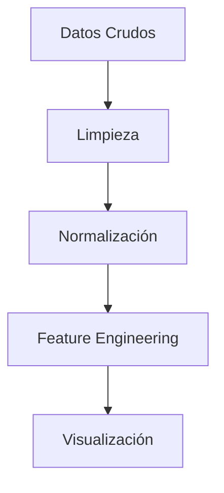

# 🌍 Proyecto | Análisis  del DataSet Global Air Pollution 


## 📌 Descripción

En este proyecto se llevará a cabo un análisis exhaustivo de ETL (Extract, Transform, Load) utilizando los datos del conjunto de datos [Global Air Pollution][kaggle] disponible en Kaggle. Además, se realizará una regresión lineal sobre los datos con el objetivo de identificar la relación entre las distintas variables y la calidad del aire.

El Global Air Pollution Dataset proporciona información detallada sobre la calidad del aire en múltiples ciudades y países alrededor del mundo. Incluye métricas clave como el Índice de Calidad del Aire (AQI) y las concentraciones de contaminantes como CO (Monóxido de carbono), NO2 (Dióxido de nitrógeno), O3 (Ozono) y PM2.5 (Material particulado fino).

Cada registro en el conjunto de datos representa las concentraciones de estos contaminantes en una ciudad específica, permitiendo una clasificación de la calidad del aire en diferentes categorías, como:

- Buena (niveles bajos de contaminación)
- Moderada (contaminación perceptible, pero dentro de rangos aceptables)
- Perjudicial para grupos sensibles (afectación a personas con problemas de salud)
- Perjudicial para la salud (niveles altos de contaminación con efectos adversos)
- Muy perjudicial (riesgo significativo para la población)
- Peligroso (niveles extremos de contaminación que requieren medidas urgentes)

Este análisis permitirá comprender tendencias y patrones de contaminación, facilitando la toma de decisiones en políticas ambientales y estrategias de mitigación. 🚀
[kaggle]: https://www.kaggle.com/datasets/hasibalmuzdadid/global-air-pollution-dataset

## 📊 Conjunto de Datos
El dataset incluye información sobre contaminantes clave, como:
- **CO** (Monóxido de carbono)
- **NO2** (Dióxido de nitrógeno)
- **PM2.5** (Material particulado fino)
- **AQI** (Índice de calidad del aire)
- **Ubicación**

## 🎯 Objetivos del Proyecto
- Análisis exploratorio de los datos 📊
- Limpieza y transformación del dataset 🔄
- Visualización de tendencias de contaminación 🌍
- Modelado predictivo de calidad del aire 📈

#### 🛠️ Pipeline ETL

El siguiente diagrama representa el flujo de transformación de datos en el proceso ETL:



## 🛠️ Tech Stack Principal
Las principales tecnologías empleadas en este proyecto son:
- **Procesamiento:** Python 3.10, Pandas, NumPy
- **Visualización:** Matplotlib, Seaborn, Plotly
- **Entorno:** Jupyter Lab, VS Code
- **Control de Versiones:** Git, GitHub Actions
- **Modelado:** Scikit-learn (Regresión lineal) 

## 🚀 Instalación
Para ejecutar este proyecto en tu máquina local, sigue los siguientes pasos:

1️⃣ Clona el repositorio:
```bash
git clone https://github.com/ctobar96/global-air-pollution-.git
```

2️⃣ Navega hasta el directorio:
```bash
cd global-air-pollution-
```

3️⃣ Instala las dependencias necesarias:
```bash
pip install pandas matplotlib seaborn scikit-learn
```
4️⃣ Abre Jupyter Notebook para explorar los análisis:
```bash
jupyter notebook
```

## 📂 Estructura del Proyecto
```bash
Global-Air-Pollution-/
│── data/                # Datos crudos y procesados
│   ├── global_air_pollution.csv
│   ├── dataset_clean.csv
│── notebooks/           # Análisis y exploraciones en Jupyter Notebook
│   ├── 001_Analisis_Exploratorio.ipynb
│   ├── 002_Limpieza_de_Datos.ipynb
│   ├── 003_Transformacion_de_Datos.ipynb
│   ├── 004_Regresion_Lineal.ipynb
│── README.md            # Documentación del proyecto
│── LICENSE              # Licencia del proyecto

```

## 📄 Licencia
[MIT License](LICENSE) - Ver archivo adjunto para detalles

---

👨💻 **Autor:** Cristian Tobar Morales  
📧 **Contacto:** cristiantobarmorales@gmail.com  
🔗 **LinkedIn:** [](https://www.linkedin.com/in/tu-perfil)