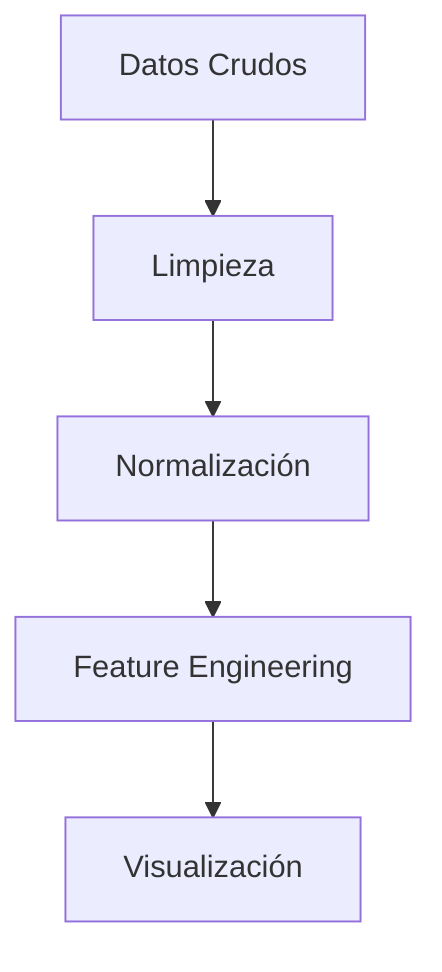

# 🌍 Proyecto | Análisis  del DataSet Global Air Pollution 


## 📌 Descripción

En este proyecto se implementara  un análisis exautivo  de  ETL (Extract, Transform, Load) de los datos del dataset [Global Air Pollution][kaggle] de Kaggle, de igual manrea se raliza una regresion linela de los datos, con el bojetivo de determinar la relaxion de los datos. 

El Global Air Pollution Dataset es un conjunto de datos que proporciona información sobre la calidad del aire en diversas ciudades y países del mundo. Contiene métricas clave como el Índice de Calidad del Aire (AQI) y las concentraciones de contaminantes como CO, NO2, O3 y PM2.5

Cada registro en este conjunto de datos representa las concentraciones de estos contaminantes en una ciudad en particular, proporcionando una clasificación de la calidad del aire que puede ser: 

- Buena
- Moderada
- Dañina para Grupos Sensibles
- Dañina
- Muy Dañina
- Peligrosa

[kaggle]: https://www.kaggle.com/datasets/hasibalmuzdadid/global-air-pollution-dataset

## 📊 Conjunto de Datos
El dataset incluye información sobre contaminantes clave, como:
- **CO** (Monóxido de carbono)
- **NO2** (Dióxido de nitrógeno)
- **PM2.5** (Material particulado fino)
- **AQI** (Índice de calidad del aire)
- **Ubicación**

## 🎯 Objetivos del Proyecto
- Análisis exploratorio de los datos 📊
- Limpieza y transformación del dataset 🔄
- Visualización de tendencias de contaminación 🌍
- Modelado predictivo de calidad del aire 📈

#### 🛠️ Pipeline ETL

El siguiente diagrama representa el flujo de transformación de datos en el proceso ETL:



## 🛠️ Tech Stack Principal
Las principales tecnologías empleadas en este proyecto son:
- **Procesamiento:** Python 3.10, Pandas, NumPy
- **Visualización:** Matplotlib, Seaborn, Plotly
- **Entorno:** Jupyter Lab, VS Code
- **Control de Versiones:** Git, GitHub Actions
- **Modelado:** Scikit-learn (Regresión lineal) 

## 🚀 Instalación
Para ejecutar este proyecto en tu máquina local, sigue los siguientes pasos:

1️⃣ Clona el repositorio:
```bash
git clone https://github.com/ctobar96/global-air-pollution-.git
```

2️⃣ Navega hasta el directorio:
```bash
cd global-air-pollution-
```

3️⃣ Instala las dependencias necesarias:
```bash
pip install pandas matplotlib seaborn scikit-learn
```
4️⃣ Abre Jupyter Notebook para explorar los análisis:
```bash
jupyter notebook
```

## 📂 Estructura del Proyecto
```bash
Global-Air-Pollution-/
│── data/                # Datos crudos y procesados
│   ├── global_air_pollution.csv
│   ├── dataset_clean.csv
│── notebooks/           # Análisis y exploraciones en Jupyter Notebook
│   ├── 001_Analisis_Exploratorio.ipynb
│   ├── 002_Limpieza_de_Datos.ipynb
│   ├── 003_Transformacion_de_Datos.ipynb
│   ├── 004_Regresion_Lineal.ipynb
│── README.md            # Documentación del proyecto
│── LICENSE              # Licencia del proyecto

```

## 📄 Licencia
[MIT License](LICENSE) - Ver archivo adjunto para detalles

---

👨💻 **Autor:** Cristian Tobar Morales  
📧 **Contacto:** cristiantobarmorales@gmail.com  
🔗 **LinkedIn:** [](https://www.linkedin.com/in/tu-perfil)